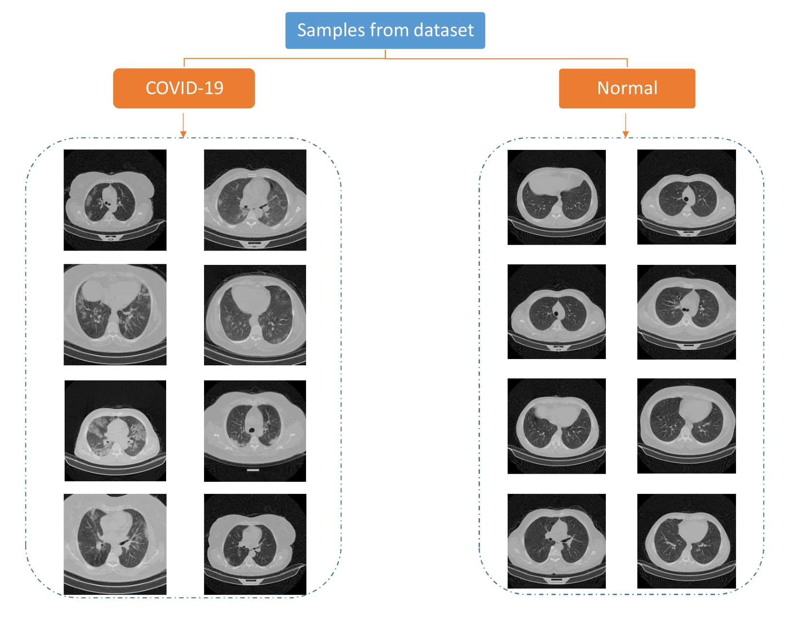
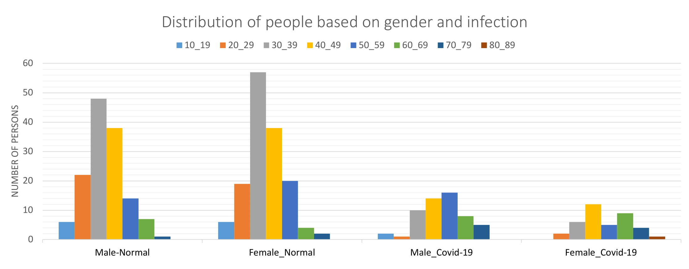
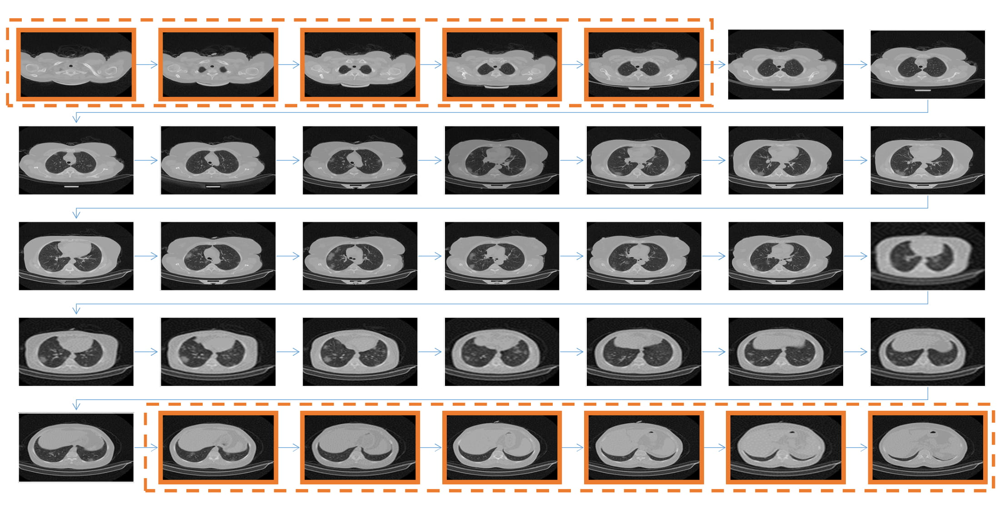

# COVID-CTset : A Large COVID-19 CT Scans dataset containing 63849 images from 377 patients

**The Whole dataset is shared in this folder:**<br />
https://drive.google.com/drive/folders/1xdk-mCkxCDNwsMAk2SGv203rY1mrbnPB?usp=sharing<br />
or you can download the whole dataset in three parts from:<br />
https://figshare.com/articles/dataset/COVID-CTset_part1/13668596<br />
https://figshare.com/articles/dataset/COVID19-CTset_part2/13669969<br />
https://figshare.com/articles/figure/COVID19-CTset_parts_3_5/14174606

**One part of the dataset(sufficient for training and testing deep neural networks) is also shared at:**
https://www.kaggle.com/mohammadrahimzadeh/covidctset-a-large-covid19-ct-scans-dataset

COVID-CTset is our introduced dataset. **This dataset contains the full original CT scans of 377 persons. There are 15589 and 48260 CT scan images belonging to 95 Covid-19 and 282 normal persons, respectively.** It was gathered from Negin medical center that is located at Sari in Iran. This medical center uses a SOMATOM Scope model and syngo CT VC30-easyIQ software version for capturing and visualizing the lung HRCT radiology images from the patients. The format of the exported radiology images was 16-bit grayscale DICOM format with 512*512 pixels resolution. As the patient's information was accessible via the DICOM files, we converted them to TIFF format, which holds the same 16-bit grayscale data but does not conclude the patients' private information.

One of our novelties is using a 16bit data format instead of converting it to 8bit data, which helps improve the method's results. Converting the DICOM files to 8bit data may cause losing some data, especially when few infections exist in the image that is hard to detect even for clinical experts. This lost data may be the difference between different images or the values of the pixels of the same image. The pixels' values of the images differ from 0 to almost 5000, and the maximum pixels values of the images are considerably different. So scaling them through a consistent value or scaling each image based on the maximum pixel value of itself can cause the mentioned problems and reduce the network accuracy. So each image of COVID-CTset is a TIFF format, 16bit grayscale image.

**The images of this dataset are 16-bit uint grayscale in TIFF format, so you can not visualize them with normal monitors( They would appear as black images).**
To make these images visible with regular monitors, we converted them to float by dividing each image's pixel value by the maximum pixel value of that image. This way, the output images had a 32bit float type pixel values that could be visualized by regular monitors, and the quality of the images was good enough for analysis.
**You can use [Visualize.py](Visualize.py) to convert the dataset images to a visualizable format.**

**Find our paper at [Here](https://github.com/mr7495/COVID-CTset/blob/master/CT_V3.pdf)**

**If you use our data, please cite the paper.**

Some of the images of our dataset are presented in the next figure.

<p align="center">
    
    <br>
    <em>Some of the images of our dataset</em>
</p>


Our dataset is constructed of two sections. **The first section includes training and testing data and the second section is the raw data for all the persons.** We converted the images to 32-bit float types on the TIFF format so that we could visualize them with regular monitors. Then we took the help of the clinical experts under the supervision of dr.sakhaei (Radiology Specialist) in the Negin medical center to select the infected patients' images that the infections were clear on them. We used these data for training and testing the trained networks.

To report more real and accurate results, we separated the dataset into five folds for training, validating and testing. Almost 20 percent of the patients with COVID19 were allocated for testing the model in each fold, and the rest were considered for training. Because the number of normal patients and images was more than the infected ones, we almost chose the number of normal images equal to the COVID-19 images to make the dataset balanced. Therefore the number of normal images that were considered for network testing was higher than the training images.

The number of images and patients is listed in the next table.


COVID-19 Patients | Normal People | COVID-19 Images | Normal Images
------------ | ------------- | ------------- | ------------- 
 95 | 282 | 15589 | 48260 

The details of the training and testing data are reported in the next tables.


Fold (Training Set)  | COVID-19 Patients | COVID-19 Images | Normal Patients | Normal Images
------------ | ------------- | ------------- | ------------- | ------------- 
Fold1 | 77 | 1820 | 45 | 1916 
Fold2 | 72 | 1817 | 37 | 1898 
Fold3 | 77 | 1836 | 53 | 1893 
Fold4 | 81 | 1823 | 76 | 1920 
Fold5 | 73 | 1832 | 71 | 1921 

Fold (Testing Set)  | COVID-19 Patients | COVID-19 Images | Normal Patients | Normal Images
------------ | ------------- | ------------- | ------------- | ------------- 
Fold1 | 18 | 462 | 237 | 7860 
Fold2 | 23 | 465 | 245 | 7878 
Fold3 | 18 | 446 | 229 | 7883  
Fold4 | 14 | 459 | 206 | 7856  
Fold5 | 22 | 450 | 211 | 7785  

<p align="center">
    
    <br>
    <em>The distribution of our dataset</em>
</p>

As indicated this dataset is shared in two parts. **The first part with the name (Training&Validation.zip) contains the images for training, validation, and testing the networks in five folds. You can also find the CSV files of the images(labels) in the CSV folder.<br /> 
The second part (COVID-CTset.zip) contains the whole dataset for each patient.** 

**Each patient has three folders (SR_2, SR_3, SR_4), which each folder show one sequence of the lung HRCT scan images of that patient (One time the patient's lung opens and closes). Each of these folders show the CT scans of the same patient that was recorded with different thickness.**

**In [Patient_details.csv](Patient_details.csv), the thickness of each CT Scans folder for each patient is reported.** 

In the next figure you can see what a sequence look like:

<p align="center">
    
    <br>
    <em>An image sequence belongs to one folder of the CT scans of a patient</em>
</p>


**The details of each patient is presented in [Patient_details.csv](Patient_details.csv)**


**The images of this dataset are 16-bit uint grayscale in TIFF format, so you can not visualize them with normal monitors( They would appear as black images).**<br /> 

**As the images of the dataset can not be visualized by regular monitors, you can use [Visualize.py](Visualize.py) to convert them to a visualizable format.**

**The published version of our paper is available at:** </br>
 https://doi.org/10.1016/j.bspc.2021.102588
 
 **The pre-prints are available at:** </br>
 
 https://doi.org/10.1101/2020.06.08.20121541
 
 https://www.researchgate.net/publication/341804692_A_Fully_Automated_Deep_Learning-based_Network_For_Detecting_COVID-from_a_New_And_Large_Lung_CT_Scan_Dataset
 
 https://www.preprints.org/manuscript/202006.0031/v3
 
 **The codes for data analysis and training or validating the networks based on this dataset are shared at https://github.com/mr7495/COVID-CT-Code.**
 
**If you use our data, please cite it by:**

 ```
@article{RAHIMZADEH2021102588,
title = {A fully automated deep learning-based network for detecting COVID-19 from a new and large lung CT scan dataset},
journal = {Biomedical Signal Processing and Control},
pages = {102588},
year = {2021},
issn = {1746-8094},
doi = {https://doi.org/10.1016/j.bspc.2021.102588},
url = {https://www.sciencedirect.com/science/article/pii/S1746809421001853},
author = {Rahimzadeh, Mohammad and Attar, Abolfazl and Sakhaei, Seyed Mohammad},
}
 ```

 If you have any questions, contact me by this email : mr7495@yahoo.com
 
